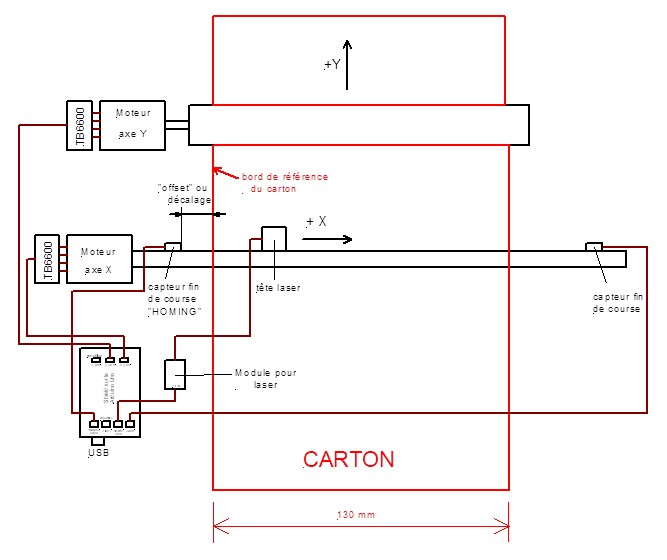

+++
title="Initialisation de GRBL pour la perforation laser"

description="Comment initialiser GRBL et régler les paramètres pour une perforation fonctionnelle et efficace"

date="2021-01-01"
categories=["perforation", "krunch", "cnc", "laser"]
author="Jean Pierre Rosset"
+++

Ces éléments sont transmis à titre d'information, pour permettre de mettre au points vos machines, et les utiliser avec APrint Studio, Un forum est en place sur le site de freddy pour permettre d'avoir plus de détails, ainsi que des questions réponses associées à la fabrication et mise en place

Le site de freddy : [https://orguedebarbarie.vraiforum.com/index.php](https://orguedebarbarie.vraiforum.com/index.php)


# Utilisation de GRBL et brochage sur Arduino UNO


Pour utiliser une machine Laser avec un Arduino ou d'autres microcontrolleurs, **la version 1.1 de GRBL est nécessaire**. 


**ATTENTION :** Pour les version Perfo (avec Poinçons), l'ancienne version 0.9 Ajustée pour intégrer le M100 est nécessaire, vous trouverez plus d'information sur [cette version spécifique à cette URL](https://github.com/barrelorgandiscovery/grblPunch). et des [informations complementaires de mise en oeuvre sont accessibles à cette URL](http://www.barrel-organ-discovery.org/site/krunch.html). [Avec l'ensemble des logiciels ici](http://www.barrel-organ-discovery.org/site/download.html)


Dans L'utilisation Laser, **ATTENTION**, GRBL A Changé le câblage et le rôle des PINS

**L’ancienne version de GRBL (0.8-0.9) l'attribution des pins est la suivante :**


**DANS la Nouvelle version de GRBL l’attribution diffère au niveau des pins 11 et 12 :**


# **Comment obtenir un GRBL 1.1 adapté pour la commande des perforatrices Laser :**

Pour que la commande $H puisse être active et ainsi réaliser le Homing uniquement sur l’axe X, c’est-à dire la mise au « zéro mécanique » de la machine, il faut un GRBL 1.1 adapté. En effet le GRBL 1.1 usuel téléchargé depuis internet, est souvent compilé pour réaliser le Homing sur les 3 axes X, Y et Z.

Pour les perforatrices, il faut réaliser le Homing que sur l’axe X (position 0 de la tête laser).

### 1 - Télécharger le code source GRBL et l’adapter

Télécharger le fichier ZIP depuis https://github.com/grbl/grbl, bouton « Code » et « Download ZIP ». Décompresser le fichier.

C’est avant la compilation du fichier initial qu’il faut adapter le fichier grbl/grbl/config.h.

Là où le fichier définit les variables de compilation HOMING_CYCLE_0/1/2, remplacer toutes les définitions par :

\#define HOMING_CYCLE_0 (1<<X_AXIS)

et pas de HOMING_CYCLE_1 ou HOMING_CYCLE_2.

(ceci vient du commentaire https://github.com/grbl/grbl/issues/1440)

### 2 - Inclure la librairie GRBL modifiée dans Arduino IDE

Tout d’abord, supprimer les anciennes versions de GRBL dans Ardunio IDE (dossier Documents/Arduino/libraries).

Ensuite, importer le dossier grbl/grbl comme librairie dans Arduino IDE (Menu Croquis / Inclure une bibliothèque / Ajouter la bibliothèque ZIP), et sélectionner le dossier grbl/grbl (même si ce n’est pas à proprement parler un fichier ZIP ! cela fonctionne – le ZIP que nous avons téléchargé n’a pas de config.h adapté).

### 3 - Compiler et téléverser GRBL

Ouvrir le croquis grblUpload dans le dossier grbl/grbl/examples.

Menu Croquis / Téléverser.

### 4 - Exporter le fichier HEX

Pour distribuer cette version de GRBL, Croquis / Exporter les binaires compilées.

Deux fichiers **.hex** sont créés dans le dossier **grbl/grbl/examples/grblUpload**. La distinction entre les deux fichiers n’est, semble-t-il, pas importante si on utilise la programmation via USB.


# **Paramétrage GRBL 1.1 sur Arduino :**

Le paramétrage se fait alors que l’Arduino est branché et que vous êtes en liaison série avec lui. 
Il existe beaucoup de logiciels différents permettant d’envoyer le G-Code et de contrôler GRBL. Nous allons paramétrer GRBL le plus simplement du monde avec le logiciel Universal Gcode Sender (UGS), en envoyant manuellement les commandes.

### Connexion à GRBL Arduino en utilisant Universal GCode Sender


**Lancer UniversalGcodeSender** : Attention sélectionner le bon port COM et Baud : 115200 et Ouvrir


Sélectionner Dans « Contrôle Machine » : La liste des paramètres de réglage est donnée par la commande :   $$ et valider au clavier par « ENTER ».

Pour modifier ces paramètres, il faut sélectionner « Commands », dans la fenêtre taper par exemple $100=100 et valider au clavier par « ENTER ».

Si vous refaite $$, la valeur que vous avez mise (100) sera à la ligne $100 changée en $100=100.


Le paramétrage utilisé pour la perfo de Jean Pierre :


#### **Pour calibrer ou modifier :**

- Le nombre d’impulsions par mm de déplacement en X (fourche) :		 $100
- Le nombre d’impulsions par mm de déplacement en Y (avance carton) :	$101
- La vitesse en déplacement de l’axe X (le laser) :				$110
- L’accélération en déplacement de l’axe X (le laser) :			$120
- La vitesse en déplacement de l’axe Y (avance carton) :			$111
- L’accélération en déplacement de l’axe Y (avance carton) :		$121


#### **Description des fonctions des paramètres :**


| **Settings and sample values** | **Description**                           |
| ------------------------------ | ----------------------------------------- |
| $0=20                          | Step pulse, 			microseconds      |
| $1=255                         | Step idle delay, 			milliseconds |
| $2=0                           | Step port invert, 			mask        |
| $3=2                           | Direction port 			invert, mask   |
| $4=0                           | Step enable invert, 			boolean   |
| $5=1                           | Limit pins invert, 			boolean    |
| $6=0                           | Probe pin invert, 			boolean     |
| $10=2                          | Status report, mask                       |
| $11=0.010                      | Junction deviation, 			mm        |
| $12=0.002                      | Arc tolerance, mm                         |
| $13=0                          | Report inches, 			boolean        |
| $20=0                          | Soft limits, boolean                      |
| $21=1                          | Hard limits, boolean                      |
| $22=1                          | Homing cycle, boolean                     |
| $23=1                          | Homing dir invert, 			mask       |
| $24=50.000                     | Homing feed, mm/min                       |
| $25=1500.000                   | Homing seek, mm/min                       |
| $26=1                          | Homing debounce, 			milliseconds |
| $27=1.000                      | Homing pull-off, mm                       |
| $30=1000.                      | Max spindle speed, 			RPM        |
| $31=0.                         | Min spindle speed, 			RPM        |
| $32=1                          | Laser mode, boolean                       |
| $100=80.000                    | X steps/mm                                |
| $101=29.800                    | Y steps/mm                                |
| $102=250.000                   | Z steps/mm                                |
| $110=500.000                   | X Max rate, mm/min                        |
| $111=500.000                   | Y Max rate, mm/min                        |
| $112=500.000                   | Z Max rate, mm/min                        |
| $120=10.000                    | X Acceleration, 			mm/sec^2      |
| $121=10.000                    | Y Acceleration, 			mm/sec^2      |
| $122=10.000                    | Z Acceleration, 			mm/sec^2      |
| $130=200.000                   | X Max travel, mm                          |
| $131=200.000                   | Y Max travel, mm                          |
| $132=200.000                   | Z Max travel, mm                          |


### **Réglage du référentiel "Machine" et référentiel "Carton"**

Le positionnement des capteurs de homing, et orientation des axes sont repérés par jean pierre comme suit :




- Dans « Contrôle Machine » : La machine est mise au « HOMING » par la commande $H disponible par un bouton.
- Pour déplacer le rayon laser (réglé au minimum) sur le bord de référence du carton, il faut générer un « offset » :
- La commande est à faire une seule fois. L’offset reste stocké dans le Arduino même s’il est non alimenté).
- Avec le bouton X+ et en ajustant Step size amener le rayon laser en bordure du carton (bord de référence).
- Dans « Commands » et dans la fenêtre, taper : G10L20P1X0Y0 (l’origine carton est mémorisée dans l’EEPROM).
- Ce paramétrage peut se voir avec la commande : $#
- Puis vous pouvez tester l’autre limite du carton en tapant dans « Commands », dans la fenêtre, G0X130,
  faire au clavier « Enter ». Pour un carton de 130 mm de largeur, la tête laser se déplace et le rayon laser doit être juste sur l’autre bord du carton.


#### Réglage du référentiel Machine et Carton


Pour enregistrer le décalage entre le zéro mécanique et le zéro carton (bord de référence)


1. Lancer UGS et ouvrir. Le Arduino répond

2. Faire le « Homing » ($H)

3. Taper la commande G10L20P1X0Y0

    

4. Noter les valeurs :  

|      | Work Position | Machine Position |
| ---- | ------------- | ---------------- |
| X    | 220           | -199             |
| Y    | 100           | 400              |

Remarque : Le $130 = 200 dans les paramètres du GRBL lu avec $$


1. Allumer le laser en Test Mode et faire -PWM pour voir encore le point laser sur le carton sans trop d’intensité lumineuse
2. Taper G0X75Y0, remarque : mon « offset » est de 77.5 en X (un point et pas une virgule).
3. Le point laser se déplace et n’est pas encore sur le bord de référence du carton
4. Taper G0X78Y0
5. Le point laser se déplace trop et dépasse le bord de référence du carton
6. Taper G0X77.5Y0 : le point laser se déplace et est, cette fois exactement sur le bord de référence du carton
7. Refaire les opérations en affinant la valeur de X jusqu’à ce que le point laser soit exactement sur le bord de référence du carton

|      | Work Position | Machine Position |
| ---- | ------------- | ---------------- |
| X    | 77.5          | -121.5           |
| Y    | 0             | 0                |

1. Taper la commande G10L20P1X0Y0

|      | Work Position | Machine Position |
| ---- | ------------- | ---------------- |
| X    | 0             | -121.5           |
| Y    | 0             | 0                |

En tapant la commande : $#, 

On peut voir le décalage du référentiel de travail de la machine, par rapport au référentiel machine :

```
>>> $#
>>> [G54:-121.500,0.000,0.000]

```

ATTENTION : veillez bien à ce que le décalage en Y soit 0, si ce paramètre n'est pas zero, après le Homing, le carton se déplacera de cette longueur.


1. Taper $H

|      | Work Position | Machine Position |
| ---- | ------------- | ---------------- |
| X    | -77.5         | -199             |
| Y    | 2000          | 2000             |

1. Taper G0X0Y0

   La machine se place sur le bord de référence carton

|      | Work Position | Machine Position |
| ---- | ------------- | ---------------- |
| X    | 0             | -121.5           |
| Y    | 0             | 2000             |

1. Tapez G0X130
2. Le point laser se déplace exactement sur l’autre bord du carton


Le réglage machine est alors correctement effectué


#### Si vous êtes perdu

Si vous avez des problèmes pour avoir 0,0,0 sur le panneau de controle alors que vous devriez, il y a peut être des offsets qui ont été programmés et vous avez à les supprimer.

- Déplacez la tête sur l'origine machine avec G53 G0 X0 Y0
- Supprimez tous les offsets G92 en utilisant G92.1
- Utilisez le système de coordonnées G54 avec G54
- Définissez le système de travail G54 pour qu'il soit le même que la machine avec G10 L2 P1 X0 Y0 
- Désactivez l'offset outil avec G49


[Vous trouverez plus de précisions sur les systèmes de coordonnés à cette adresse](http://linuxcnc.org/docs/html/user/user-concepts.html)


# Pour utilisation en mode laser dans APrint

S'assurer que le GRBL est bien en mode "Lazer" : Commande $32=1

Configurez le retour d'information $10=2

**Nota**: ce mode de retour, permet à APrint de connaitre les ordres disponibles dans la mémoire de GRBL et de pouvoir alimenter la machine au fur et à mesure. Dans le cas où la machine devient lente, ou se bloque: vérifiez ce paramètre.

[plus d'information à cette adresse (documentation du mode laser GRBL 1.1)](https://github.com/gnea/grbl/wiki/Grbl-v1.1-Laser-Mode)


## Utilisation d'APrint

Une fois le GRBL de configuré, dans la vue carton d'APrint, [vous pouvez suivre cet article, dans la documentation](https://www.barrel-organ-discovery.org/site/doc/2020/product/krunch/perfo_lazer/)

